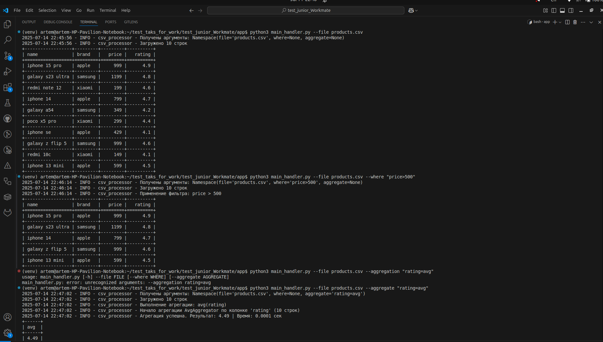
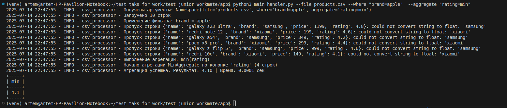

# Запуск приложения

Клонируйте репозиторий

```
git clone https://github.com/ArtemSimon/test_junior_Workmate.git

```

Перейдите в директорию проекта, нужно конкретно перейте в папку app!

```
cd test_junior_Workmate
cd app
```

Примеры скриптов





Отдельно команды,запускать также все из папки app!

```
python3 main_handler.py --file products.csv 

python3 main_handler.py --file products.csv --where "price>500"

python3 main_handler.py --file products.csv --aggregate "rating=avg"

python3 main_handler.py --file products.csv --where "brand=apple"  --aggregate "rating=min"
```